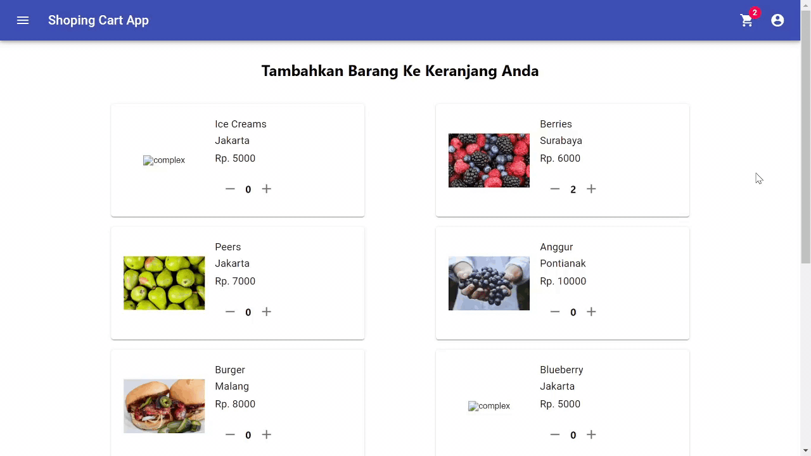

# Project Description :bread:
This website is a website that is used to checkout the items you want to buy. This website was created using React js and Material UI as the UI Framework from React js. In addition, this website also uses redux as state management

# Project Link :link:
You can see the results of this project by opening the following link https://shoping-cart-react-redux.herokuapp.com/

# Tools :hammer_and_wrench:
Tools used to make this tip calculator application are as follows :
* Visual Studio Code

# Language :computer:
The language used in making this tip calculator is as follows :
* HTML
* CSS
* Javascript
